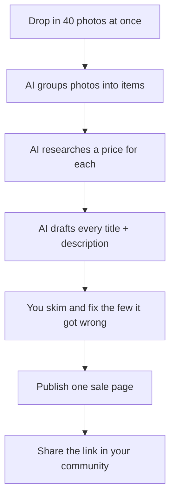
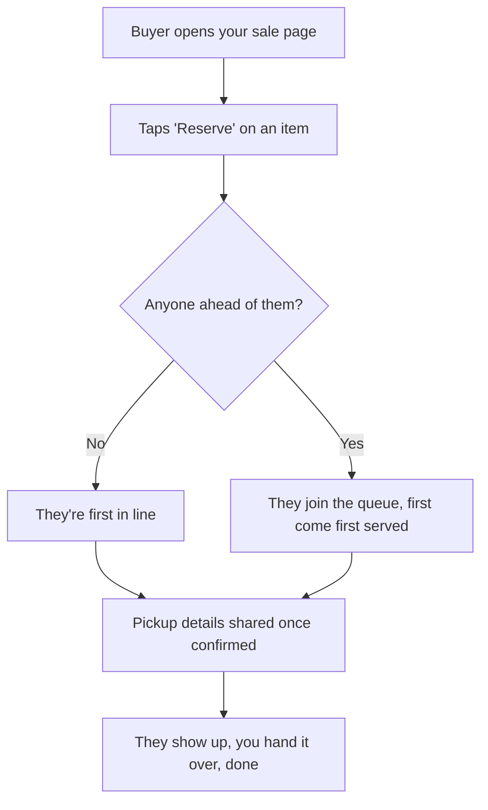
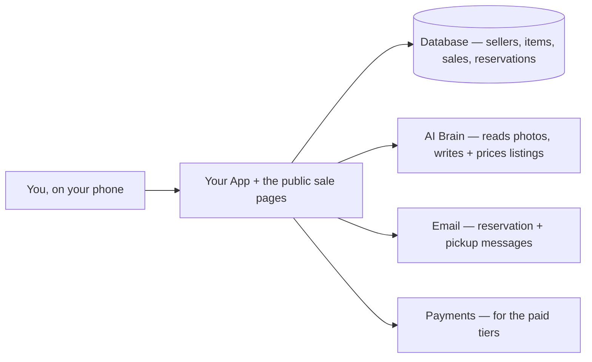

*This is a full vibe-check session on the ClearList idea, start to finish. Claude asks the questions, I answer, and it ends with the plan it generated. The reality-check pulls from real seller complaints on r/declutter. This is what running the skill actually feels like.*

---

# vibe-check — A Full Session (ClearList)

**Claude:** Before we design a single screen, I want to make sure we're building the right thing. No tech talk yet. First question, plain and simple: who is this for, and what's the moment it actually hurts them?

**Me:** People who are moving or clearing out a house. They've got a ton of stuff they want to sell, and they just... never get around to it.

**Claude:** "Never get around to it" is the interesting part. Think back to the last real time you, or someone you watched, tried to sell a pile of stuff. What actually stopped it?

**Me:** It's the per-item grind. For one thing you photograph it, look up what it's worth, write a description, measure it, post it, then haggle and meet the buyer. It's like an hour of work for one item that sells for twenty bucks.

**Claude:** So you just listed the *steps*, photographing, pricing, writing, meeting. That's all solution-shaped, it's the work, not the want. Let me push on the other side: if all of that work vanished, what does the person actually walk away with? What's the win, in their words?

**Me:** The pile is gone, they got some money for it, and it didn't take over their life.

**Claude:** Here's what I'm hearing, tell me if I've got it wrong. You pitched "an app that writes your listings." But writing a listing faster is one step out of ten, and it still leaves you doing the whole thing forty times. The real job is closer to: *clear the entire pile before the move, without it eating me alive.* That's a different product than a faster single-listing tool. Does that land?

**Me:** Yeah. That's exactly it. The whole pile is the problem, not any one listing.

**Claude:** Good. That reframing changes everything downstream, so I want to make sure it's true and not just a nice story. Let me check it against what real sellers say when they're venting, not what we're guessing. The place these people gather is r/declutter. One sec.

Here's what's in there, and it's strong validation for your hypothesis:

- Listing one item runs about an hour of work, photograph, research, write, measure, post, haggle, meet, for maybe twenty dollars.
- One person actually did the math on their net after fees and time and landed at roughly **$1.20 an hour**.
- They call the backlog a "death pile", rooms full of stuff waiting to be listed, sometimes for *years*. One person's guest room was so full a visiting friend had to get a hotel.
- No-show buyers are one of the top motivation-killers. People quit after the third person ghosts a pickup.
- And the single most upvoted conclusion in these threads: "just donate it, the relief of it being gone beats the money."

**Me:** That last one is exactly what I keep seeing. People would genuinely rather give it away than deal with selling.

**Claude:** Then that's your real competition, and it's the most important line in this whole plan: **you are not competing with eBay. You're competing with the donation bag.** Your benchmark is being faster than giving up and driving to Goodwill. Every scoping call we make has to clear that bar. A tool that speeds up one listing doesn't clear it, because you still do it forty times. A tool that clears the whole pile in one sitting does. Hold that thought.

Quick one to lock the dream before we design: finish this sentence. "It's working perfectly when I..."

**Me:** When I walk through the house taking photos, dump them all in at once, and a minute later I've got a finished sale page I can just share.

**Claude:** Perfect, "dump them all in at once" is the heart of it. Before I marry that design, let me sketch three different directions and we'll keep the best of each. I'll do the generating, you just react.

- **A, The Faster Lister.** One photo in, a great listing out. Speeds up a single item.
- **B, The Batch Clear-Out.** Drop 40 photos at once. It groups them into items, prices each, writes them all, and hands you one sale page for the lot.
- **C, The Estate-Sale-in-a-Box.** Everything in B, plus a buyer queue and pickup scheduling, because coordinating buyers is half the misery.

My recommendation is B as the backbone. A is just a slower B in disguise and it doesn't beat the donation bag. C is right eventually, but the queue and scheduling are a lot to build before you've proven people want the core. Which way's your gut?

**Me:** B, for sure. But the no-show thing from Reddit worries me, so I'd want C's reservation idea soon after.

**Claude:** Agreed, and that's the right order: B is V1, the reservation and pickup piece is the very next thing, since no-shows were literally the #3 pain people named. Before we lock B in, let me run it through five quick gut-checks.

- **Desirable?** Yes. The whole subreddit is asking for it.
- **Usable?** Yes. Take photos, skim, publish, share a link. A non-techy person can do that.
- **Feasible?** Yes. A vision model can read a photo, group items, draft a listing, research a price.
- **Viable?** Cheap per sale. The real cost is the AI calls per batch, which a paid tier for big moves covers.
- **Ethical?** This one needs three rules baked in now, so they don't get bolted on later:
  1. The AI's price has to be honest comparable-sales research, shown *with* what it's based on. Never inflated to flatter the seller or pad a fee. A bad price recreates the exact pain we're killing.
  2. Local pickup means strangers meeting. The seller's home address stays hidden until a buyer is actually committed, and the app nudges safe-meetup habits.
  3. No fake urgency on buyers. No "3 people watching this!" The app should win when stuff sells, not when people panic.

That third lens is the one most builders skip. Anything there you'd push back on?

**Me:** No, those are exactly right. The address-privacy one especially. I don't want sellers exposing where they live.

**Claude:** Then it's a hard rule in the plan, not a nice-to-have. From here I'll move quicker and just confirm decisions with you.

**Tech.** For something you want on a phone without app-store hassle, I'd build a web app that installs from the browser (a PWA) on Next.js. Database, login, and the live "watch your listings appear" updates come from Firebase. The AI brain is the Gemini API. Email for reservations and pickup details is Resend. Payments for the paid tier go through Paddle, which also handles sales tax for you so you don't have to learn tax law. Good?

**Me:** Yep, that's the stack.

**Claude:** **Distribution.** This matters as much as the build, so we plan it now, not after launch. Who are your first ten users, and where do they already gather?

**Me:** Same place we just got our validation. r/declutter, the moving subreddits, local "moving sale" Facebook groups.

**Claude:** Then your first move isn't a launch link, it's showing up there and being useful for a couple of weeks, then telling one honest "I built this because I had a pile too" story. That community is the launch.

**Growth loop.** Here's one built into the core: every sale page is a public, good-looking, shareable link. Buyers and browsers see it, and a few of them think "I've got a pile too" and become sellers. The one number to watch is new sellers per shared sale page. If that's near zero, the loop isn't real and r/declutter stays the engine.

**Me:** Love that. The sale page selling the app itself.

**Claude:** Last thing before the plan, the stuff beginners get blindsided by: apply to your payment provider early, before you write payment code. You'll need a privacy policy, and because we're handling home addresses, that address rule has to be enforced in code, not just promised. Passwords scrambled, API keys in a protected file, never in the code.

Okay. I've got everything I need. Here's your plan.

---

# THE PLAN: ClearList (V1)

*The instruction manual you hand your AI coding tool. Specific on purpose, a vague plan builds a vague app.*

## The Problem

"I'm moving in three weeks with a houseful of stuff. I know I should sell it, but each item is an hour of work for twenty bucks, so it sits there and I end up donating it all the day before the truck comes."

## The Vision

Walk through the house taking photos. Drop them all in at once. A minute later you've got a full set of grouped, written, priced listings you just skim and fix. Publish one sale page, share the link, people reserve for local pickup. The pile becomes money and an empty room, in one session.

## The Goal

- **Accomplishing:** clearing the whole pile before the deadline and getting paid for it.
- **Instead, today:** list one at a time until you burn out, then donate the rest.
- **Why that sucks:** the per-item effort is so high the money never feels worth it, so the stuff wins.

## Who It's For

People mid-move or clearing an estate, 20–100 items, a hard deadline. First 10 users from one declutter or moving community you can show up in.

## User Flows

**The batch clear-out (happy path):**



**The buyer reserving an item:**



**When the AI gets one wrong (the rough day):** the review screen flags the low-confidence items so you check those first. Fix a price, merge two photos into one item or split one into two, and regenerate that single listing without redoing the whole batch.

## Features

**V1 (build now, the part that beats the donation bag):**

- Batch photo upload (a whole pile at once, not one at a time)
- AI groups photos into items, drafts title + description, researches a price
- A review screen that surfaces the low-confidence ones first
- One public sale page with a shareable link
- Local pickup with a simple "reserve this item" button

**V2+ (later, and roughly what ClearList has grown into today):**

- A multi-agent pipeline (grouping → generator → price research → QA → corrector) for higher-quality listings
- A real first-come-first-served buyer queue with reservations and no-show handling
- Pickup scheduling wired to your calendar
- Paid tiers for big moves and estate sales
- An admin "control room" for operations

## System Architecture



## Tech Stack

| Tool | What it does | Why it's here | Cost |
|---|---|---|---|
| Next.js (PWA) | The app and the public sale pages; works like an app on a phone | One codebase, installs from the browser, no app store needed | Free |
| Vercel | Hosting; makes sale pages fast with nice link previews | A shared sale link looks good and loads instantly | Free to start |
| Firebase / Firestore | Database + login + live updates as listings generate | Easiest managed database for a beginner, real-time, backs itself up | Free tier |
| Gemini API | The AI brain: reads photos, groups items, writes and prices listings | Strong vision, cheap enough to run a 40-photo batch | Pay per use |
| Resend | Sends the emails (reservations, pickup details) | Dead simple email for a beginner | Free tier |
| Paddle | Payments for paid tiers, and handles sales tax as merchant-of-record | You don't want to learn tax law to sell a Sale Pass | % per sale |
| Google Calendar API | Pickup scheduling (V2) | Buyers pick a slot instead of endless back-and-forth | Free |

## Data Model (in plain words)

- A **seller** has an account.
- An **item** has photos, a category, a condition, a generated title and description, and a researched price, and belongs to a sale.
- A **sale** (the sale page) has a title, a public link, and a list of items, and belongs to a seller.
- A **reservation** links a buyer to an item and remembers their place in line.
- A **pickup** has a time and place, created once a reservation is confirmed.

## Cost Breakdown

Near **$0/month** to start except the AI calls, a few cents per batch of photos. Everything else sits on free tiers until you have real volume. The paid tier for big moves covers the AI cost.

## Distribution (start before launch, not after)

First 10 users in **r/declutter, the moving subreddits, and local "moving sale" Facebook groups**. The first move is not a launch link, it's being useful there for two weeks, then posting one honest "I built this because I had a pile too" story. *(For ClearList, a single honest Reddit post is what produced its first real traction. The channel is the launch.)*

## Growth Loop

A **content loop** built into the core: every sale page is a public, shareable link that looks clean. Buyers and browsers see it, and a few think "I've got a pile too" and become sellers.


- **Enabling feature (on the V1 list):** the public, good-looking, shareable sale page.
- **The one number to watch:** new sellers per shared sale page. If sale pages aren't pulling in new sellers, the loop isn't real yet, and r/declutter is the growth engine instead.

## Things to Handle Before Launch

- **Payments:** apply to your payment provider early, before you write payment code. *(Now.)*
- **Privacy/legal:** a real privacy policy, and the home-address rule from the ethics check enforced in code. *(Before launch.)*
- **Safety:** safe-meetup guidance for local pickups. *(Before launch.)*
- **Security:** passwords scrambled, API keys in a protected `.env` file, never in the code. *(Now.)*

## Build Phases

1. Project setup and folders
2. Database + the data model (sellers, items, sales)
3. Login (sign up, log in, log out)
4. **Core:** batch photo upload → AI groups, writes, and prices → review screen
5. The public sale page + shareable link
6. Reserve-an-item + local pickup
7. Polish, error handling, the low-confidence review flow
8. Payments (the paid tier)
9. Pre-launch (privacy policy, address rule, security pass, safe-meetup copy)
10. Deploy

Sample checkpoint, the one after Phase 4 (every phase gets one):

```
═══════════════════════════════════════════════════════════
🔖 CHECKPOINT: The Core Batch Engine
═══════════════════════════════════════════════════════════
📍 WHERE WE ARE
"We just built the heart of the whole thing. You can drop in a pile
of photos and get back a full set of listings — grouped, written,
and priced — that you only have to skim and fix."
🔧 WHAT WE JUST BUILT
- A screen that takes many photos at once instead of one at a time.
- The AI step that groups photos into items, writes each listing,
  and researches a price for it.
- A review screen that shows you the ones it's least sure about first.
💡 WHY WE BUILT IT THIS WAY
"Remember how we realized the real competition is the donation bag,
not eBay? That's why the very first thing we built is the batch, not
a prettier single listing. Beating 'just donate it' only works if a
whole pile takes one session, so the batch had to come first."
📋 WHAT'S NEXT
"Next we'll turn that batch into a public sale page with a link you
can share — the thing your buyers actually see."
❓ QUESTIONS?
"Does this make sense? Want to run a real pile of photos through it
before we move on?"
Wait for the user before continuing.
═══════════════════════════════════════════════════════════
```

## Open Questions

- Group photos into items fully automatically, or let the seller confirm the grouping before pricing?
- One flat price suggestion, or a range with the comps shown so the seller picks?

---

*Generated by [vibe-check](https://github.com/TexasBedouin/vibe-check), which turns a beginner's one-line idea into a plan their AI coding tool can build, and refuses to skip the part where you figure out if you're building the right thing.*

*The product this session is modeled on is real and live. **ClearList** turns a pile of stuff into a ready-to-share sale page, built for moving and estate sales. See the grown-up version of this plan at [clearlist.me](https://clearlist.me).*

*Reflects vibe-check v1.7.2.*
