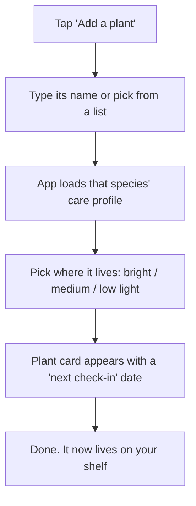
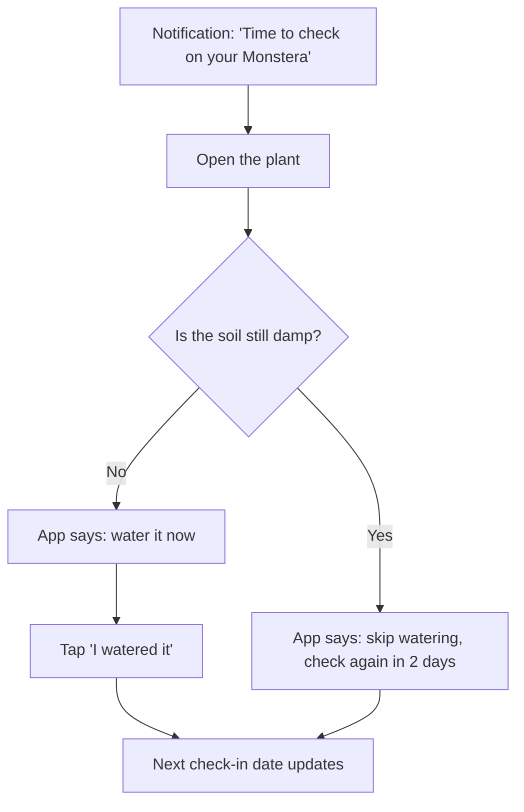
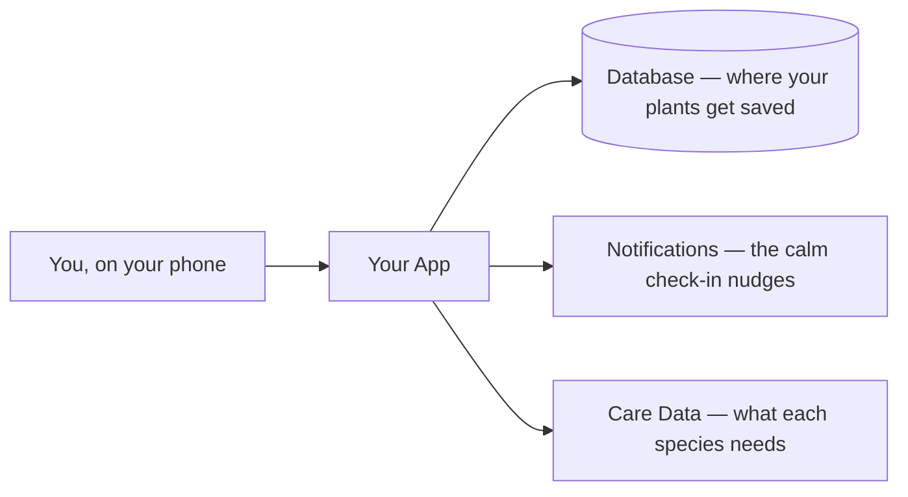
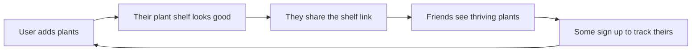

*A worked example of what vibe-check produces. The input is one sentence from a complete beginner. Below is a condensed view of the session (the thinking) followed by the plan document it hands to your AI coding tool. A real session is a back-and-forth conversation; this is trimmed for reading.*

---

# vibe-check — Example Output

## The starting idea

> "I want to build an app that reminds me to water my plants."

That's the whole input. Here's what the skill does with it.

---

## 1. The pressure-test (before any design)

The skill doesn't start sketching screens. It starts by interrogating the problem and the person.

**It asks who actually has this pain.** Not "people," a specific person. The answer that comes back: someone with 8–15 houseplants who keeps killing them and feels bad about it, not someone with one cactus.

**It reframes the idea.** "You said *watering reminder*. But a reminder assumes the only problem is forgetting. When I look at what plant owners actually struggle with, forgetting isn't the main one. Overwatering kills more houseplants than underwatering. So the real pain might not be *'remind me to water'*, it might be *'tell me what THIS plant needs so I stop killing it.'* A reminder app that nags you to water on a fixed schedule could actively make the problem worse." That's the signature move: the first idea was a solution wearing a problem's clothes.

**It reality-checks against the real world.** A quick look at where these people gather (r/houseplants, r/plantclinic) shows the most common cry for help isn't "I forgot to water," it's a photo with "why is my plant dying, I water it every day?" The pain is real, badly unsolved, and it's a *knowing-what-to-do* problem, not a *remembering* problem. Good. Worth building.

**The sharpened problem:** people who want their plants to thrive but don't know what each plant needs, and accidentally kill them with guesswork (usually by overwatering).

---

## 2. Crazy 3s (three directions, pick the best bits)

- **A — The Calendar.** A watering schedule with reminders. (This is the original idea. On its own it risks telling people to overwater.)
- **B — The Plant Profile.** Each plant gets a page: what it is, what it needs, how it's doing. Care advice, not just alarms.
- **C — The Check-In.** The app asks *you* questions ("droopy? yellow leaves? soil still damp?") and tells you what to do, instead of assuming.

**Chosen combination:** B as the backbone (a real profile per plant with species-specific care), borrowing C's "check the soil before you water" gate so it never blindly tells someone to water on a timer. A's reminders stay, but framed as "time to *check on* your Monstera," not "water now."

---

## 3. The five-lens gut-check

- **Desirable:** Yes. Plant owners actively ask for this in their own communities.
- **Usable:** Yes. The least techy plant lover can add a plant by name and read "your snake plant likes to dry out, you're probably watering too often."
- **Feasible:** Yes. An AI tool can build this. Species care data can start as a small built-in list and grow.
- **Viable:** Cheap to run. Fits comfortably on free tiers to start.
- **Ethical:** ⚠️ One thing to design out. The tempting move is anxiety-driven notifications ("Your plant is DYING 😢 you haven't watered in 5 days!!") because guilt drives app opens. That's a dark pattern, it makes money (engagement) when the user feels bad, not when the plant thrives. **Decision:** notifications stay calm and helpful ("Time to check on your Monstera"), no fake urgency, no guilt. The app wins when the plant lives, not when the user panics. If a plant shop ever gets added, no manufactured "buy this now or it dies" pressure.

Passes. The ethical catch became an actual design rule, not a lecture.

---

# The Plan

*(This is the document you hand to your AI coding tool. The more specific it is, the better the AI builds it the first time.)*

## The Problem

"My plants keep dying and I don't know why. I water them and they still droop, or the leaves go yellow. I feel like I'm doing something wrong but I can't tell what." Overwatering from well-meaning guesswork is the silent killer.

## The Vision

You open the app and see your plants as little cards, each showing how it's doing. Tap one and it tells you, in plain words, what this specific plant needs and whether it's time to actually check on it. When something looks off, the app helps you diagnose it instead of just sounding an alarm.

## The Goal

- **What you're accomplishing:** keeping your plants alive and knowing why they're thriving.
- **What you do today instead:** water on a vague guess, google panic-search when leaves yellow, lose plants.
- **Why that sucks:** the guessing is what kills the plant, and you only find out when it's too late.

## Who It's For

Houseplant owners with roughly 5–20 plants who care but feel like they have a "black thumb." Realistically your first 10 users are people in one plant community you're already part of.

## User Flows

**Adding a plant (happy path):**



**The daily check-in (the core loop):**



**When something's wrong (the rough day):** user taps "something's off," picks a symptom (yellow leaves, droopy, brown tips), and the app gives the 2–3 likely causes for *that species* and what to do. If the app doesn't know, it says so and points to the community, instead of guessing and making it worse.

## Features

**V1 (build now):**

- Add a plant, with a species care profile
- A plant card showing status and next check-in
- The "check the soil first" watering gate
- Calm reminders to check in
- Symptom helper for the common problems
- A shareable "my plant shelf" page (this is the growth-loop feature, see below)

**V2+ (later):**

- Identify a plant from a photo
- Light meter using the phone sensor
- Community Q&A in-app
- A shop (only if it can be done without panic-selling)

## System Architecture



## Tech Stack

| Tool | What it does | Why it's here | Cost |
|---|---|---|---|
| Expo (React Native) | Builds the phone app for iPhone + Android from one codebase | A beginner ships to both stores without learning two languages | Free |
| Supabase | The database + login | Generous free tier, easiest managed database for beginners, does backups for you | Free to start |
| Expo Notifications | Sends the check-in reminders | Built into Expo, no extra service | Free |
| Built-in care dataset | Species watering/light guidance | Start with ~50 common houseplants in a simple file, no paid API needed | Free |

## Data Model (in plain words)

- A **plant** has a nickname, a species, a spot (bright/medium/low light), a last-checked date, a last-watered date, and belongs to a user.
- A **species profile** has a name, a rough watering guideline, light needs, and the 2–3 common ways it dies (with fixes).
- A **check-in** records when a plant was checked, whether it got watered, and a note.
- A **user** has an account and notification preferences.

## Cost Breakdown

Roughly **$0/month** to start. Everything above has a free tier that comfortably covers your first hundreds of users. The first real cost is the Apple Developer account ($99/year) only when you publish to the App Store.

## Distribution (start before launch, not after)

Your first 10 users are in **one plant community you already belong to** (a local plant-swap group, r/houseplants, a Discord). The first concrete move: don't drop a launch link. Show up for two weeks answering "why is my plant dying" posts with genuinely good help, then mention you're building a thing for exactly this. That community IS your launch.

## Growth Loop

A modest **content loop**: every user gets a public, link-shareable "my plant shelf" page. Plant people love showing off their plants, so some will share it, and a few who see it sign up to track their own.



- **Enabling feature (on the V1 list):** the shareable shelf page.
- **The one number to watch:** shares per active user per month. If almost nobody shares, the loop isn't real, and that's fine, your r/houseplants presence is the growth engine instead.

## Things to Handle Before Launch

- **Security:** passwords scrambled, no secret keys sitting in the code (they go in a protected `.env` file). *(Handle now.)*
- **Privacy/legal:** accounts mean a basic privacy policy. *(Before launch.)*
- **Accessibility:** readable text sizes, the app works without relying only on color (yellow-leaf warnings need words too). *(Handle now.)*
- **Backups:** Supabase handles these automatically. *(Already covered.)*

## Build Phases

1. Project setup and folders
2. Database + the data model (plants, species profiles)
3. Login (sign up, log in, log out)
4. **Core:** add a plant, see its care profile, the "check soil first" watering gate
5. Reminders (push notifications)
6. The shareable plant shelf
7. Symptom helper
8. Polish + error handling + accessibility
9. Pre-launch (privacy policy, security pass)
10. Deploy to the stores

Each phase ends with a checkpoint where your AI stops, explains what it built in plain words, and waits for you. Here's the one after Phase 4, as a sample of the format:

```
═══════════════════════════════════════════════════════════
🔖 CHECKPOINT: The Core Feature
═══════════════════════════════════════════════════════════
📍 WHERE WE ARE
"We just finished the heart of your app. You can now add a plant,
see what it needs, and the app checks whether the soil is dry
before it ever tells you to water."
🔧 WHAT WE JUST BUILT
- A screen to add a plant and load its care profile.
- The 'check the soil first' gate, so the app never blindly tells
  you to water on a timer.
💡 WHY WE BUILT IT THIS WAY
"Remember how we realized overwatering is what actually kills most
plants? That's why the app asks 'is the soil still damp?' before it
ever says 'water now.' The whole reason your app exists is to stop
the guessing that kills plants, so that check had to come first."
📋 WHAT'S NEXT
"Next we'll add the calm reminders, the nudges to check on a plant
without guilt-tripping you."
❓ QUESTIONS?
"Does this make sense? Want to see it working on your phone before
we move on?"
Wait for the user before continuing.
═══════════════════════════════════════════════════════════
```

## Open Questions

- Start with a built-in list of ~50 plants, or let users add custom species from day one?
- Do reminders feel better as a fixed gentle schedule, or fully driven by the soil check-in?

---

*Generated by [vibe-check](https://github.com/TexasBedouin/vibe-check). It turns a beginner's one-line idea into a plan their AI coding tool can actually build, and refuses to skip the part where you figure out if you're building the right thing.*

*Reflects vibe-check v1.7.2.*
